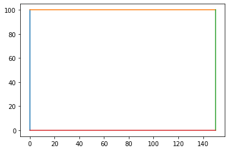
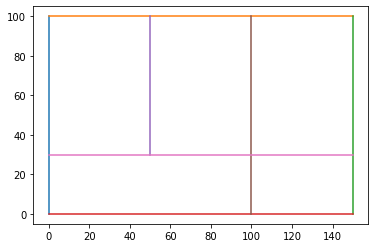
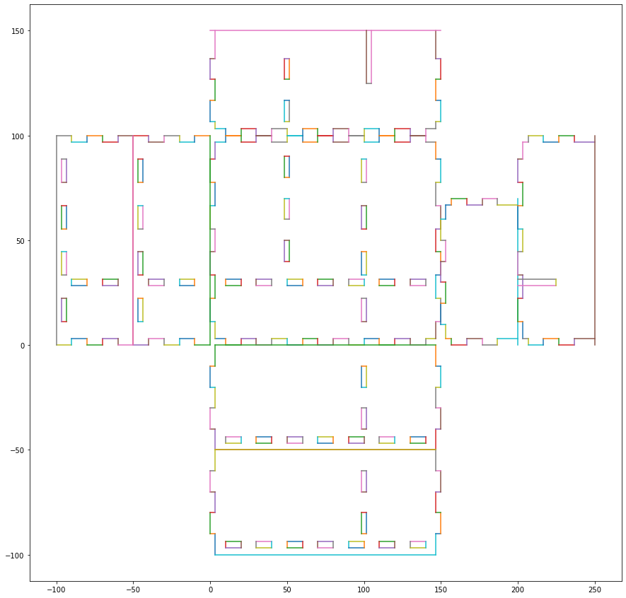

# Project name here
> Library for generating svg files for laser-printers


This file will become your README and also the index of your documentation.

## Install

Clone this repo
pip install -e .

## How to use

the easiest way is to use it with jupyter notebooks which can plot and show current settings of your boxes before generating the SVG file.

First define the size of the box and thickness of the playwood

```python
from box_generator.gen import *
import matplotlib.pyplot as plt
box = BoxGen(playwood_thickness=3.2,
                x_size_mm=150, 
                y_size_mm=100,
                height_mm=50,
                min_tabsize_mm=10)
```

We can then plot how the box looks like from above by the following commands:

```python
box.plot_outline()
```





We can add some inner compartments inside the box by defining the coordinates the start and end-point of the inner walls.
They need to be orthogonal.

```python
box.add_innerwall((50,30), (50,100))
box.add_innerwall((100,0), (100,100))
box.add_innerwall((0,30), (150,30))
box.update_inner_walls()
box.plot_outline()
```

    96.8 -30.0
    96.8 -0.0
    intersection point: (100.0, 0.0), line [100.   0. 100. 100.]
    endpoint found
    intersection point: (100.0, 0.0), line [100.   0. 100. 100.]
    endpoint found
    -0.0 66.8
    intersection point: (0.0, 30.0), line [  0.  30. 150.  30.]
    endpoint found
    intersection point: (0.0, 30.0), line [  0.  30. 150.  30.]
    endpoint found
    [ 50.  30.  50. 100.] [100.   0. 100. 100.]
    [ 50.  30.  50. 100.] [  0.  30. 150.  30.]
    [100.   0. 100. 100.] [ 50.  30.  50. 100.]
    [100.   0. 100. 100.] [  0.  30. 150.  30.]
    intersection point: (100.0, 30.0), line [  0.  30. 150.  30.]
    intersection found
    x
    2
    [200.   28.4 225.   28.4] [200.   31.6 225.   31.6] [225.   28.4 225.   31.6]
    [  0.  30. 150.  30.] [ 50.  30.  50. 100.]
    intersection point: (50.0, 30.0), line [ 50.  30.  50. 100.]
    endpoint found
    [  0.  30. 150.  30.] [100.   0. 100. 100.]
    intersection point: (100.0, 30.0), line [100.   0. 100. 100.]
    intersection found
    y
    2
    [101.6 125.  101.6 150. ] [104.8 125.  104.8 150. ] [101.6 125.  104.8 125. ]





Let's check what the blueprint looks like

```python
plt.figure(figsize=(15,15))
box.plot()
```





This looks good, lets export the drawing to an SVG file

```python
box.export_to_svg('mybox.svg')
```
